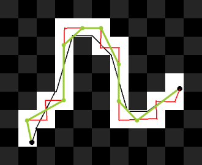

# Smoothing Pathfinding

---
title: "Smoothing Pathfinding"
date: 2025-07-16
author: "Muneeb Haq"
tags: ["raylib", "c programming", "game development", "Blog", "Algorithm"]
---

# Smoothing the pathfinding algorithm for better and more natrual looking movement

   This article concerns itself with the notion that the current pathfinding algorithm is at its current state very much not useable from an aesthtic perspective. The users and units move in a very blocky way.

## The problem 

   All of the units when designated to move all move in their desinged blocked patterned destinations. The issue with this is the follow : 
   

   We need a way to make the shortest path possible along each of the squares to ensure we get a less blocky movement.

## Smoothing algorithm
   
   SRC - https://steamcdn-a.akamaihd.net/apps/valve/2009/ai_systems_of_l4d_mike_booth.pdf

   - Solution to path smoothing would be to cast rays from the current positon to the farthest possible visibile node from the current itterable node. 
   - You would walk along the same path as the inital created path, and form a new path
   - The newly created smoothed path would be surmized of rays casted to the furthest ray to the next node along the path
   - Finally , The end will be reached.
  

